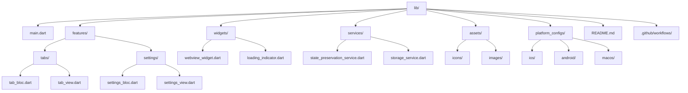

# Architecture

Here is the high-level architecture and initial project structure for the Webview POC App, based on your preferences and PRD:

---

## **Architecture Overview**

- **Framework:** Flutter (latest stable)
- **Language:** Dart
- **State Management:** Bloc
- **Webview Plugin:** webview_flutter
- **Local Storage:** shared_preferences
- **Platforms:** iOS, iPadOS, macOS, Android

---

## **Project Structure**

---

## **Next Steps**

- Scaffold the Flutter project with the above structure.
- Prepare placeholder assets (icon, privacy policy, screenshots).
- Set up a new GitHub repository for CI/CD.

---

Would you like to make any changes to this plan or add further requirements before switching to code mode for implementation?
